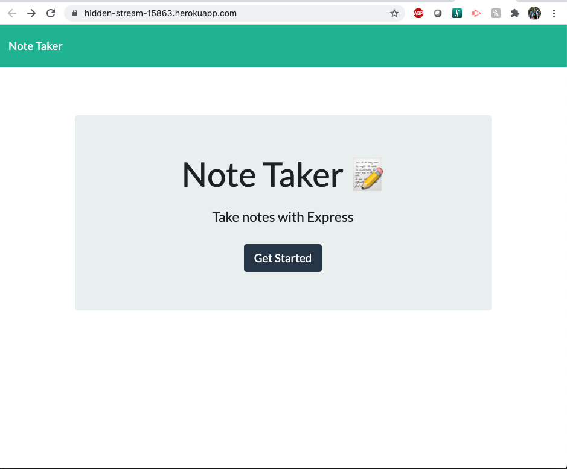
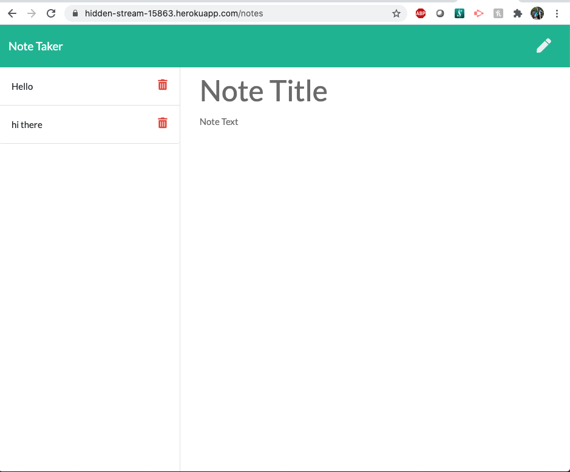

# NOTE TAKER APP

## Description
 An application that can be used to write, save, and delete notes. This application will use an express backend and save and retrieve note data from a JSON file.

## Installation
For dependencies run the below command in the CLI
```
npm i
```
## Deployed
app domain
https://hidden-stream-15863.herokuapp.com/
heroku dashboard
https://dashboard.heroku.com/apps/hidden-stream-15863

## Example
homepage

notespage

